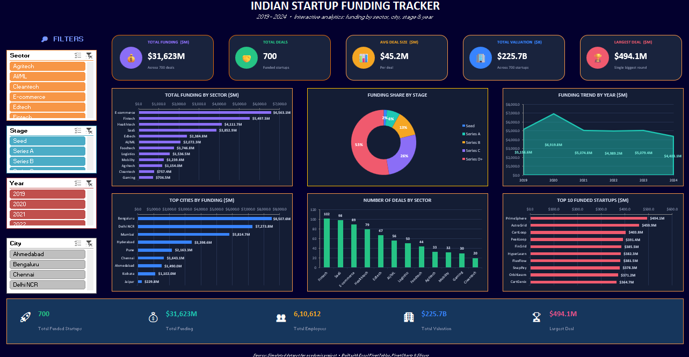
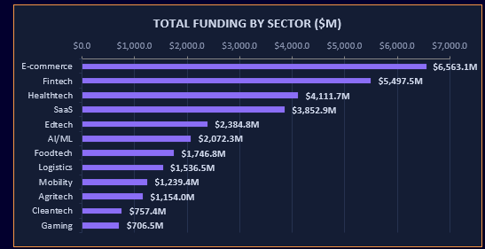
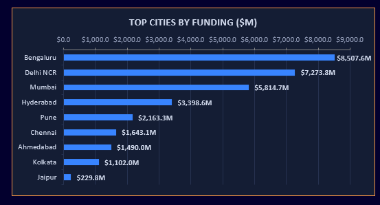
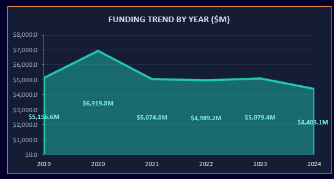
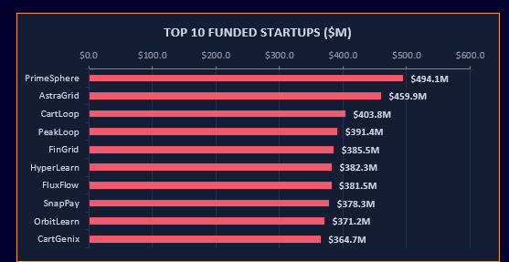

# 🚀 Indian Startup Funding Tracker Dashboard (Excel)

An interactive Microsoft Excel dashboard that analyzes startup funding trends across India from **2019–2024**. The project transforms raw funding data into an insightful dashboard using Pivot Tables, Pivot Charts, KPI Cards, and Slicers for dynamic business analysis.

---

## 📌 Project Overview

This dashboard helps users explore the Indian startup ecosystem by answering questions such as:

- Which sectors receive the highest funding?
- Which cities attract the most investments?
- How has startup funding changed over time?
- Which funding stages dominate the market?
- Which startups raised the largest investments?

The dashboard is completely interactive and updates all charts instantly using slicers.

---

# 📷 Dashboard Preview

## Complete Dashboard



---

## KPI Cards


---

## Funding by Sector



---

## Funding by City



---

## Year-wise Funding Trend



---

## Top Funded Startups



---

# 📊 Dashboard Features

✔ Interactive KPI Cards

- Total Funding
- Total Deals
- Average Deal Size
- Total Valuation
- Largest Funding Round

✔ Interactive Charts

- Funding by Sector
- Funding by Stage
- Funding Trend by Year
- Top Cities by Funding
- Number of Deals by Sector
- Top 10 Funded Startups

✔ Dynamic Slicers

- Sector
- City
- Funding Stage
- Funding Year

---

# 🗂 Dataset Information

| Feature | Description |
|----------|-------------|
| Records | 700 Startup Funding Deals |
| Period | 2019–2024 |
| Cities | 9 Indian Startup Hubs |
| Sectors | 12 Industry Categories |
| Columns | 11 |

### Dataset Fields

- Company
- Sector
- City
- Funding Stage
- Funding Amount
- Funding Date
- Funding Year
- Lead Investor
- Founded Year
- Valuation
- Employees

> **Note:** The dataset is simulated for educational purposes and closely resembles real-world startup funding data.

---

# 🛠 Tools Used

- Microsoft Excel
- Pivot Tables
- Pivot Charts
- Slicers
- KPI Cards
- Excel Tables
- Conditional Formatting

---

# 📈 Key Insights

- 💰 Total Funding exceeded **$31 Billion**
- 📊 Around **700 funding deals** were analyzed
- 🏙 Bengaluru and Delhi NCR attracted the highest investments
- 💹 E-Commerce and FinTech dominated overall funding
- 🚀 Late-stage funding accounted for the majority of capital
- 📈 Funding peaked around 2020 before stabilizing

---

# 📂 Repository Structure

```
Startup-Funding-Dashboard/
│
├── Dashboard.xlsx
├── Project_Report.pdf
├── README.md
│
└── screenshots/
    ├── dashboard.png
    ├── kpi_cards.png
    ├── sector_analysis.png
    ├── city_analysis.png
    ├── yearly_trend.png
    └── top_startups.png
```

---

# ▶ How to Use

1. Download the Excel workbook.
2. Open it in Microsoft Excel.
3. Navigate to the Dashboard sheet.
4. Use the slicers to filter data.
5. All KPIs and charts update automatically.

---

# 🎯 Skills Demonstrated

- Data Cleaning
- Data Visualization
- Business Intelligence
- Dashboard Design
- Excel Pivot Tables
- Pivot Charts
- KPI Design
- Interactive Reporting
- Data Analysis

---

# 📌 Project Highlights

- Interactive Excel Dashboard
- Modern Dark Theme
- Fully Dynamic Visualizations
- Business-Oriented KPIs
- Professional Dashboard Layout
- Recruiter-Friendly Portfolio Project

---

## 👨‍💻 Author

**Chaitanya Khurana**

If you found this project useful, consider giving it a ⭐ on GitHub.
